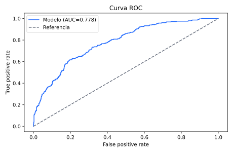
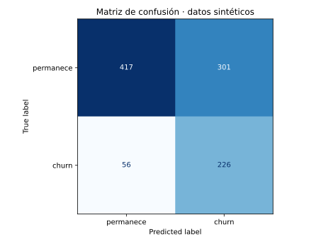

# Churn Risk con scikit-learn

Solución profesional de clasificación para priorizar la revisión de clientes con riesgo de churn. Incluye una fuente controlada con semántica de negocio, baseline, separación estratificada train/test, selección explícita de umbral, métricas, curvas, matriz de confusión, importancias y criterios comerciales.

> El dataset de referencia no contiene clientes ni desempeño de una empresa real. Permite validar entrenamiento, evaluación y gobierno del modelo sin exponer información confidencial y no autoriza decisiones automatizadas.

**Portafolio interactivo:** https://htroya.github.io/telecom-customer-360/

| Curva ROC | Matriz de confusión |
|---|---|
|  |  |

## Resumen ejecutivo

El flujo genera variables interpretables, reserva 25% de clientes para prueba, compara regresión logística con `DummyClassifier`, y selecciona el umbral que maximiza precision entre puntos que cumplen un objetivo de recall. Publica resultados tabulares y gráficos para que la calidad estadística y la carga comercial sean auditables.

**English summary:** Production-oriented churn-risk pipeline with a dummy baseline, stratified holdout, precision/recall/F1/ROC-AUC, cost-aware threshold rationale, confusion matrix, ROC/PR curves and standardized logistic-regression coefficients.

## Problema

Una campaña sin priorización trata por igual a toda la base o usa un corte arbitrario. Eso oculta cuántos casos se capturan, cuántos se pierden y cuántos contactos innecesarios genera el modelo.

## Solución y arquitectura

```text
Generador de datos de referencia
            │
            ▼
Train 75% / Test 25% estratificado
     │                         │
Dummy baseline        StandardScaler + LogisticRegression
     └──────────────┬──────────┘
                    ▼
     Métricas + selección de umbral + artefactos
                    ▼
        Interpretación y decisión comercial
```

## Tecnologías

Python, NumPy, Polars, scikit-learn, Matplotlib, Joblib, Pytest y GitHub Actions.

## Datos y modelo

Las variables son antigüedad, cargo mensual, tickets, pagos tardíos, uso y tipo de contrato. La [ficha de datos](docs/data_card.md) documenta su generación; la [ficha del modelo](docs/model_card.md) cubre alcance, evaluación, riesgos y controles.

## Ejecución

```powershell
python -m venv .venv
.venv\Scripts\python -m pip install -r requirements.txt
.venv\Scripts\python -m src.train --rows 4000 --seed 42 --target-recall 0.80
```

Para regenerar los resultados versionados sin guardar el modelo binario:

```powershell
.venv\Scripts\python -m src.train --output docs/results --skip-model
```

## Pruebas

```powershell
.venv\Scripts\python -m pytest -q
```

Las pruebas cubren reproducibilidad y rangos, parámetros inválidos, cumplimiento del recall objetivo, mejora frente al baseline y presencia de todos los artefactos.

## Métricas y resultados verificables

La ejecución vigente se resume en [metrics.json](docs/results/metrics.json) y [model_comparison.csv](docs/results/model_comparison.csv). Se publican precision, recall, F1 y ROC-AUC junto con prevalencia, umbral y las cuatro celdas de la matriz de confusión. Las curvas completas y predicciones de prueba están disponibles como CSV.

## Umbral e interpretación comercial

El [razonamiento del umbral](docs/results/threshold_rationale.md) prioriza un recall objetivo del 80% y luego maximiza precision. La [interpretación comercial](docs/results/business_interpretation.md) traduce falsos positivos/negativos a carga de revisión. En producción, el criterio debe sustituirse por costos, capacidad, valor esperado y políticas aprobadas.

## Importancia de variables

`feature_importance.csv` y `feature_importance.svg` muestran coeficientes estandarizados. Son asociaciones dentro de un proceso sintético, no causalidad. El color/dirección indica si la variable incrementa o reduce los *log-odds* estimados.

## Decisiones técnicas

- Regresión logística para una línea base interpretable y probabilidades calibrables posteriormente.
- Holdout estratificado fijo para comparación reproducible.
- `class_weight="balanced"` para reducir sesgo hacia la clase mayoritaria.
- Umbral separado del entrenamiento para hacer explícito el intercambio precision/recall.
- Datos, curvas y predicciones exportados para revisión independiente.

## Limitaciones

- Las etiquetas nacen de una fórmula sintética conocida; el desempeño será más estable que en datos reales.
- La selección de umbral usa el mismo holdout reportado; producción requeriría validación separada o cross-validation.
- No hay calibración, deriva, equidad por grupo, explicaciones locales ni experimento de uplift.
- No se incluyen costos reales, aceptación de ofertas ni resultados de retención.

## Próximos pasos

1. Definir evento, horizonte y ventana de observación con negocio.
2. Añadir cross-validation, calibración y validación temporal *out-of-time*.
3. Evaluar deriva, equidad, costo esperado y capacidad de campaña.
4. Registrar versión de datos/modelo y monitorear desempeño posterior al despliegue.

## Capturas

Las imágenes superiores se generan automáticamente desde el conjunto de prueba y las métricas versionadas.

## Licencia

[MIT](LICENSE). Datos de referencia para validación segura y reproducible del sistema analítico.
