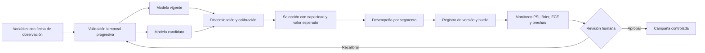

# Arquitectura de evaluación y gobierno

El umbral se decide fuera del entrenamiento. Se limita la cantidad de contactos y se calcula el valor esperado con costo de contacto y valor retenido. El reporte compara el modelo vigente con un candidato, cuantifica calibración y deriva, y separa el análisis por segmento. El manifiesto impide interpretar la puntuación como autorización automática.

